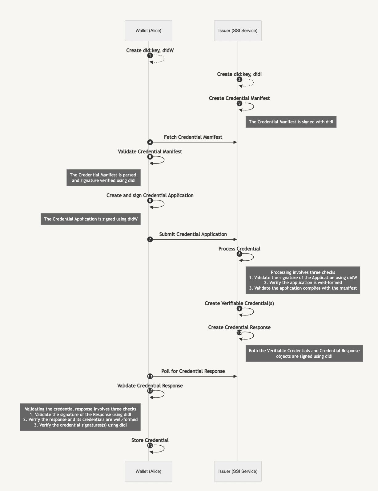

# Steel Thread Signing & Verification

# Overview

Annotated steel thread flow for calling out all signing, verification, and key management. This document is focused on
the signing and verification of objects. For Steel Thread, this means: Credentials and Credential Manifest request
objects.

## Setup

We assume there are two parties:

1. Alice, using a wallet, applying for a credential
2. An issuer via the VC Service, processing credential applications and issuing credentials

Each party has a single DID. Alice and the VC Service each have a
single `[did:key](https://w3c-ccg.github.io/did-method-key/)` DID. Alice stores her DID’s private key in her wallet. The
VC Service stores its private key in the service key store database.

## Actors

For simplicity the DWN is abstracted from the description and diagrams below, since it plays no role in issuing or
verifying credentials or credential manifest objects.

Alice and the Issuer are also abstracted from the diagram. Instead focusing on the software handling signing and
verification — Alice’s Wallet and the VC Service.

## Flow Annotation

<aside>
🛠 All objects are signed using `did:key` DIDs using `Ed25519` keys. Packaging takes place using JWTs.

</aside>

1. Alice creates a DID, stored in her wallet, `didW`
2. The issuer creates a DID, stored in the VC Service, `didI`
3. [`CM` is a JWT] The Credential Manifest `CM` is created and signed by the Issuer, with `didI`
4. Alice fetches `CM` and…
    1. Validates the signature using `didI`
    2. Verifies it is a valid and well-formed Credential Manifest
5. [`CA` is a JWT] Alice forms a response to `CM`, Credential Application `CA`
    1. Alice signs `CA` using `didW`
6. Alice submits `CA` to the VC Service
7. The VC Service processes `CA`...
    1. Validates the signature using `didW`
    2. Verifies it is a valid and well-formed Credential Application
    3. Validates it complies with `CM`
8. [`VC` is a [VC-JWT](https://w3c.github.io/vc-jwt/)] The VC Service creates Verifiable Credentials, `VC`, signed
   with `didI`
9. [`CR` is a JWT] The VC Service creates a Credential Response, `CR`, signed with `didI`
10. Alice receives `CR` containing `VC` and…
    1. Validates the signature of the `CR` using `didI`
    2. Verifies `CR` and `VC` are well-formed
    3. Verifies the signature(s) of `VC` using `didI`
    4. Possible other validity checks, such as making sure the Credential is for Alice and has expected data
11. Alice stores the `VC`
